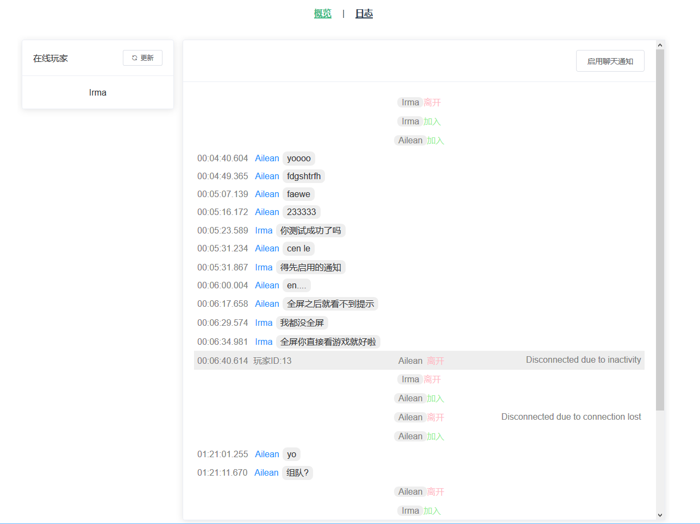

# 星界边境服务器状态揭示板

实时根据日志显示星界边境服务器状态



## 配置


配置应用目录环境变量`STARBOUND_DASHBOARD_STORAGE`, 默认为`/srv/starbound-dashboard`

参照[config.py](lib/starbound_dashboard/config.py) 在应用目录下建立quart配置文件`etc/config.py`

参照[nginx.conf](nginx.conf)在应用目录下建立nginx配置`etc/nginx.conf` 

按你的环境修改[docker-compose.override.yml](docker-compose.override.yml)

## 部署

需求npm和docker

```bash
npm i -d
npm run build
docker-compose up --build
```


